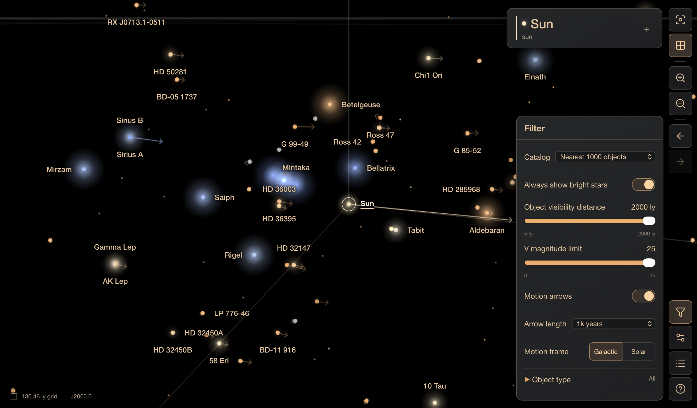

# Star View

A Sun-centered 3D map of nearby stars and brown dwarfs that runs in the browser. Built with TypeScript, Three.js and Vite. All data, fonts and icons are bundled, so it runs without a backend or network access.

## Features

- Four bundled catalogs: **Nearest neighbors** (21 objects plus the Sun, default), **Nearest 100**, **Nearest 1000**, and magnitude-limited **Bright stars** within 2000 light-years
- Orbit, zoom and pan with mouse or touch; selecting an object centers it
- Inspector with type, constellation, spectral class, temperature, mass, radius, metallicity, age, magnitude, distance and source notes
- Searchable list of every object in the catalog
- Map filters for brightness as seen from the selected star, distance from the Sun (to 2000 light-years), object type, and an optional deduplicated bright-star overlay
- Temperature-based colors, magnitude-based glow and motion arrows
- Distance and height guides relative to the Sun
- Light-year or parsec units, grid toggle and an optional power-saving mode
- Desktop and mobile layouts

## Getting Started

Requires Node.js 24 LTS, npm and a WebGL2-capable browser.

```sh
npm ci
npm run dev
```

Open the local URL printed by Vite.

| Command | Purpose |
| --- | --- |
| `npm run dev` | Start the development server |
| `npm run build` | Validate catalogs, type-check and build into `dist/` |
| `npm run preview` | Serve the production build |
| `npm run typecheck` | Type-check without building |
| `npm run test` | Run unit tests (Vitest) |
| `npm run test:e2e` | Build, then run desktop and mobile browser tests (Playwright) |
| `npm run catalog:validate` | Validate all bundled catalogs |

Before the first browser test run, install Chromium with `npx playwright install chromium`, or use installed Chrome via `PLAYWRIGHT_CHANNEL=chrome npm run test:e2e`.

`dist/` is a static site. When hosting it, configure the compression and caching headers described in [Development](docs/development.md#build-and-hosting).

## Controls

| Action | Mouse | Touch |
| --- | --- | --- |
| Orbit | Left-drag | One-finger drag |
| Zoom | Scroll wheel | Pinch |
| Pan | Right-drag | Two-finger drag |
| Select and center | Click an object | Tap an object |
| Clear selection | Click empty sky | Tap empty sky |

The toolbar has reset view, grid toggle, zoom controls, and back/forward navigation through the 20 most recent star selections. The Objects list supports search and keyboard selection.

## Data

The default catalog is [src/data/stars.csv](src/data/stars.csv); the others are in `src/data/catalogs/<id>/`. Builds validate them and generate browser-ready JSON automatically, without downloads or Python. The larger catalogs come from audited, frozen source releases and do not claim complete membership.

Positions are a fixed J2000 snapshot in a Sun-centered, Galactic-aligned frame. Colors and glow are illustrative, not calibrated photometry.

## Documentation

- [User guide](docs/user-guide.md): browsing, filters and what the visuals mean
- [Data reference](docs/data-reference.md): coordinate frame, CSV format, sources and motion conversion (referenced by catalog source notes)
- [Catalog sourcing](docs/catalog-sourcing.md): how catalogs are built, reproduced and extended
- [Development](docs/development.md): build and hosting, rendering performance, tests and project structure

## License

See [LICENSE](LICENSE).
