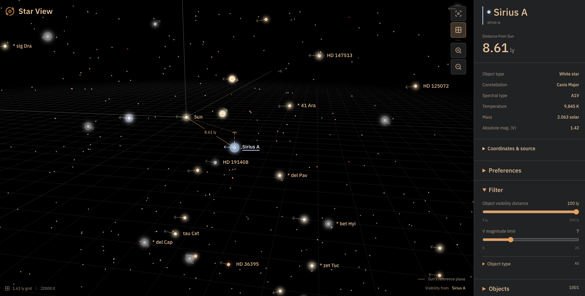

# Star View

A Sun-centered 3D browser for nearby stellar and substellar objects, built with TypeScript, Three.js, plain HTML/CSS, and Vite. Choose **Nearest neighbors** (21 objects plus Sun, the default), **Nearest 100 objects**, or **Nearest 1000 objects**. All are bundled; no backend or runtime catalog service is required. The larger catalogs use audited frozen source releases, not a claim of complete 2026 membership. See the [offline sourcing and custom-catalog guide](docs/catalog-sourcing.md).

## Run

Use Node.js 24 LTS and npm.

```sh
npm ci
npm run dev
```

Open the local URL printed by Vite. The port advances automatically if its default port is already occupied. All star data, fonts, and icons are bundled locally.

```sh
npm run typecheck
npm run catalog:validate
npm run test
npm run build
npm run test:e2e
npm run preview
```

The production output is in `dist`. Builds validate every project catalog, generate deterministic browser-ready JSON from the authored CSV, and emit each catalog as a separate hashed asset. Catalogs load only when selected and each payload is fetched and parsed at most once per page session. Papa Parse remains an authoring/test dependency and is not shipped in the browser bundle. Normal builds never download astronomy data or require Python.

Vite also emits Brotli sidecars for compressible production assets. The local preview server negotiates those files and gives hashed `/assets/` responses a one-year immutable cache policy while keeping HTML revalidated. Production hosting must provide the equivalent `Content-Encoding: br`, `Vary: Accept-Encoding`, `Content-Type`, and `Cache-Control` behavior; copying `.br` files alone is not sufficient.

### Rendering efficiency

The static star map renders on demand. Camera input, selection, display settings, resizing, pixel-density changes and font loading request a frame; requests within a frame are combined. Smooth focus and orbit damping keep rendering only until motion settles. An idle view performs no recurring WebGL draws or label updates, and hidden tabs suspend rendering until visible again. MSAA remains enabled.

Normal rendering caps the WebGL canvas at device-pixel ratio 1 and at 60 frames per second. A short `requestAnimationFrame` cadence sample promotes the cap to 120 FPS on displays measured at 100 Hz or faster. The optional session-only power-saving mode is off by default; it caps the canvas at device-pixel ratio 0.5 and sustained rendering at 30 FPS. The first dirty frame after an idle period may render immediately for input responsiveness. Orbit damping remains enabled, with its factor adjusted for elapsed time so settling takes approximately the same time at every cap.

These limits reduce canvas pixels and bound repeated projection, label-layout and draw work while the camera moves. Automated browser tests verify the selected backing resolution, draw spacing and complete suspension while idle. They do not prove lower hardware power on every browser or GPU; compare modes using the same scripted interaction over repeated, warmed-up runs and total energy rather than isolated watt spikes.

During rotation, each visible object is projected once into reusable storage shared by labels, arrows, collisions and picking. A screen-space grid bounds collision and pointer searches. Only budgeted names, the selected/observer labels and currently relevant arrows own pooled DOM anchors instead of creating one subtree per catalog row. Label dimensions are cached and refreshed in a single batch after selection, units, fonts or viewport changes. Rotation regression tests cover all three catalogs, including nearest-1000, and record browser layout and main-thread timing metrics.

Only the visibility base and eligible objects submit halo points to the GPU; background dots keep their cores but do not draw transparent halos. A reusable index buffer updates this subset when visibility settings or selection change. The three colored axes share one draw call. Browser tests count point submissions and draw calls alongside the visual regression checks.

To compare power use in Safari, use `npm run build && npm run preview`, leave the map untouched for a few seconds, and observe Safari's CPU usage in Activity Monitor. Expect brief activity during interaction. The browser regression suite checks that WebGL draws and label mutations stop while idle in both catalogs and resume after changes; this measures rendering work, not a hardware-specific CPU percentage.

## Browse

- Select a catalog with the dropdown. The Objects disclosure starts closed; open it to search or use the object buttons, which also work with a keyboard. Every object remains searchable, even when faint or coincident with another point. Large result sets use a virtual viewport instead of creating every row at once.
- Catalog switching preserves common object selection, the visibility base, units, filter limits, object types, grid and disclosure settings, and fits the new catalog. A missing selected object clears selection; a missing visibility base falls back to Sun. Only one scene is active at a time.
- Choose pc or ly for all distance readouts; ly is the default. The preference is remembered on this browser when storage is available. Geometry remains in parsecs and all measurements remain Sun-relative; changing units does not move the camera. Source notes are unchanged.
- Object visibility distance is a Sun-centered, map-only filter from 5 to 100 ly and defaults to 100 ly. The complete catalog remains in Objects, while the selected object and visibility base remain visible as exceptions. Object types open in their own dropdown for individual selection.
- Click or tap empty sky to clear selection, its measurement guides, and inspector details without moving the camera. The last selected object stays the visibility base. Orbit drags, pinches, and toolbar actions do not clear selection. Select another dot or catalog entry to restore details and change the base.
- Selection centers the object by easing the orbit/zoom target over 300 ms while preserving the camera's position. A new selection replaces the transition; direct pointer input, zoom buttons, reset, or deselection interrupt it immediately. Reduced-motion preferences use instant focus and disable the selection pulse; enabling reduced motion during focus completes it immediately. Drag with the primary mouse button or one finger to orbit. Use the wheel or two-finger pinch to zoom; right-drag or a two-finger drag pans.
- The toolbar provides reset-view, grid, zoom-in, and zoom-out buttons. The grid toggle sits directly below reset and starts enabled; it hides the grid, all three axis lines and their labels, and the grid legend, leaving stars, measurements, and the camera unchanged. Reset restores the all-catalog framing and preserves selection and grid visibility. Startup selects Sirius A without leaving that all-catalog view.
- The inspector shows a conservative plain-language object type, Earth-view constellation, spectral class, temperature, mass, absolute Johnson V magnitude and Sun distance. Unsupported spectra fall back to a broad object type instead of guessing. Coordinates & source contains epoch, velocities, available bolometric luminosity and source notes. Height measurement guides remain in the map.
- On narrow screens, the inspector scrolls below the scene, without covering it. Compact heading spacing leaves more sky visible; toolbar hover tooltips appear only for fine, hover-capable pointers, while keyboard-focus tooltips and 44 px targets remain available on all devices.

Visibility uses apparent Johnson V magnitude from the selected or last-selected object's position: `m_V = M_V + 5 log10(distance_pc / 10)`. The Filter slider defaults to +7, approximately one magnitude beyond dark-sky naked-eye +6, and ranges from 0 to 25. The unrounded inclusive threshold decides eligibility, not halo size/intensity. Higher limits include fainter objects. Only the loaded catalog is considered, not the complete sky from that location; extinction and variability are not modeled.

The visibility base and eligible objects retain approximately 10 CSS px crisp cores. Other objects are 3 CSS px temperature-colored dots with no halo, name or motion arrow, but unchanged generous mouse/touch hit targets. Missing V photometry and distinct objects at the same stored position are background, never assumed bright. Selecting any object makes it the base and keeps it prominent even without photometry; deselection removes only its selection boost, ring and guides. Approximate co-located binary coordinates are not a physical zero separation or a license to invent component brightness.

Eligible halos retain a diameter of `clamp(60 - 3 * absolute_mag, 18, 64)` CSS px: Sirius A roughly 56 px, Barnard's Star 20 px. A base without magnitude uses 26 px. Sizes do not vary with camera zoom. Cores use camera depth for overlap; halos blend additively without writing depth or bleaching core centers. The illustrative temperature ramp runs from cold red to blue-white, clamped to 250-40,000 K; unknown temperatures use neutral gray. A brown dwarf's colored locator is not a claim of optical brightness. These are neither calibrated spectra nor stellar radii.

For eligible objects, intrinsic Johnson V absolute magnitude controls halo strength: `clamp(0.65 * 10^(-0.1 * (absolute_mag - 4.83)), 0.08, 1.4)`, with a clamped exponent for extreme inputs. A missing-magnitude base uses neutral gain 0.65; the Sun now has the sourced absolute V value +4.83. Bolometric luminosity is never substituted. Selection boosts gain by 1.3, capped at 1.8. Opacity is `0.9 * (1 - exp(-1.4 * gain))`, preserving temperature tint without whitening. The texture fades continuously without an annular hole; strict depth testing keeps it off its own core without a dark outline. The glow remains an intrinsic visual-brightness cue, not apparent-brightness scaling.

The interface uses night-light orange text and accents on charcoal panels, retaining the black sky, IBM Plex Sans, and temperature-based object colors. Map labels show only the object name, without a spectral-class subtitle, at a fixed 22 CSS pixel offset to the right of the dot during orbit and zoom. Unselected names hide at collisions or edges instead of switching sides. Their stacking and collision priority follow camera depth, nearest first, rather than catalog order; farther dots and arrows do not hide nearer names. Interface controls, nearer objects, and a star's own arrow still reserve space. The selected name uses heavier, lightened text and a temperature-colored underline, with a matching glowing ring and inspector identity accent. Its brief ring pulse does not loop. The selected name always stays in the foreground with a dark backing, ignoring collisions; it clamps to the scene edges when necessary, even when the star is offscreen or behind the camera. Its selection ring and motion arrow still disappear when the actual star is clipped. Spectral classes remain available in the inspector.

Supporting graphics stay secondary: unselected motion arrows use 50% opacity and the selected arrow uses full opacity, without changing any dimensions or visibility rules. The grid fades from 40% opacity near the center to transparent at its outer radius; axes use 55% opacity. Axis captions retain a fixed 18 CSS pixel right offset from their projected endpoints and render behind the transparent canvas, so stars cover them. They never dodge stars or star names; only viewport and interface clipping can hide them. The scene background remains black. Selected measurement guides retain their original emphasis. These effects do not fade stars or their labels.

Small arrows on eligible objects indicate projected motion. Solid arrows use complete three-dimensional motion in the existing approximate Galactic-rest frame. Dashed shafts indicate Sun-relative transverse motion derived from parallax and proper motion when radial velocity is unavailable or withheld; no zero RV or solar velocity is inserted. Only shaft length scales with speed: `clamp(speedKms / 10, 12, 40)` CSS px. Arrowheads and strokes retain the original 16 CSS px styling. Zoom and camera angle do not change their dimensions; this is not a travel distance. Arrows do not intercept clicks, and positions remain static.

## Coordinate Convention

Positions use a **right-handed, Sun-centered, Galactic-aligned Cartesian frame**:

| Catalog axis | Positive direction |
| --- | --- |
| `x_pc` | Galactic longitude 0 degrees, latitude 0 degrees, toward the Galactic center |
| `y_pc` | Galactic longitude 90 degrees, latitude 0 degrees |
| `z_pc` | North Galactic pole |

The reference plane is `z_pc = 0`, passing through the Sun. It is not a claim about the physical Galactic midplane or the Sun's offset from it. This is not a Galactocentric frame.

The renderer maps `(x_pc, y_pc, z_pc)` to Three.js Y-up coordinates `(x_pc, z_pc, -y_pc)`. One scene unit equals one parsec on every axis, with no height exaggeration. A parsec is approximately 3.26156 light-years. The grid spacing is 0.5 pc.

A selected object has a direct Sun-to-object line and, when off the plane, a dashed perpendicular height line to a square projection marker. The faint dashed in-plane line completes the spatial triangle. The square is a measurement marker, not another object. Selecting the Sun removes the zero-length guides.

Only the Sun-distance text is shown on the map; the height text (such as “0.40 pc below”) is omitted. The distance label stays in the foreground beside the direct line's midpoint, with clearance around the Sun and selected star's halos. It follows the line smoothly and ignores other label collisions. At a screen edge it can change sides or move to a clear corner; it hides only if no tested position fits without covering an endpoint.

## CSV Data

The default data stays in [src/data/stars.csv](src/data/stars.csv). Other packages have sibling `catalog.json` and `stars.csv` files under `src/data/catalogs/<id>/`. `npm run catalog:generate` validates those tracked sources and creates ignored runtime JSON under `src/data/generated/`; development and production builds run it automatically. This version has no browser-upload UI. For repeatable multi-source research, frozen inputs, native authoring, provenance and validation commands, see [docs/catalog-sourcing.md](docs/catalog-sourcing.md).

All original 16 headers must occur exactly once; `constellation` is optional for legacy/custom files. Enriched files may append the complete raw-astrometry group below. A partial raw group and unknown/duplicate headers are rejected.

```csv
type,id,name,spectral_type,x_pc,y_pc,z_pc,vx_kms,vy_kms,vz_kms,temperature_k,mass_solar,luminosity_solar,absolute_mag,epoch,notes,constellation
```

```csv
ra_deg,dec_deg,astrometry_epoch,parallax_mas,parallax_error_mas,pm_ra_cosdec_masyr,pm_ra_error_masyr,pm_dec_masyr,pm_dec_error_masyr,radial_velocity_kms,radial_velocity_error_kms,astrometry_ref,radial_velocity_ref
```

Raw astrometry is source-epoch ICRS data. `pm_ra_cosdec_masyr` includes `cos(dec)`. Parallax must be positive; uncertainties are nonnegative. Radial velocity and its source may be blank, but are never replaced by zero. The common Cartesian `epoch` remains the static J2000 map snapshot and is distinct from `astrometry_epoch`.

| Field | Meaning |
| --- | --- |
| `type` | Required object class: `star`, `white_dwarf`, `brown_dwarf`, or `sub_brown_dwarf` |
| `id` | Required, unique string; `sun` is reserved for the reference Sun |
| `name` | Required display name |
| `spectral_type` | Optional spectral classification |
| `x_pc`, `y_pc`, `z_pc` | Required finite coordinates in parsecs |
| `vx_kms`, `vy_kms`, `vz_kms` | Optional Cartesian velocities, relative to the Sun, along the same axes in km/s |
| `temperature_k` | Optional, positive effective temperature in kelvin; estimates distinguished in source notes |
| `mass_solar` | Optional, positive mass relative to the Sun |
| `luminosity_solar` | Optional, positive bolometric luminosity relative to the Sun |
| `absolute_mag` | Optional Johnson V absolute magnitude, not bolometric magnitude |
| `epoch` | Required decimal Julian year of the coordinate snapshot; initially `2000.0` |
| `notes` | Optional source and object notes; quote cells containing commas or newlines |
| `constellation` | Optional full canonical IAU name; blank for Sun |

The Sun must be present at `(0, 0, 0)`, with velocities zero or blank. All rows must share an epoch. Blank optional values mean **unknown**, never zero. Values must use finite decimal numbers, optionally with an exponent. Signed coordinates, velocities, and magnitudes are valid. Invalid catalogs produce a record/field error instead of silently omitting objects. CSV text is rendered as text, not HTML.

The epoch describes the astrometric snapshot, not the observation date of every physical parameter. Positions are static; neither proper motion nor binary orbits are propagated to the current date. A radial velocity is not interchangeable with a Cartesian velocity component.

Constellations are the Earth-view IAU regions at the adopted snapshot, assigned offline from sky directions using Astropy's Roman/Delporte boundary table. They do not change with visibility observer, units or camera orientation. Every non-Sun object in all three bundled catalogs has one, even without V photometry. Sun displays Not applicable; a legacy/custom unknown displays Not available. Boundary-frame transformation is not physical motion propagation to 1875.

### Catalog Policy And Provenance

The default sample ranks individual stellar and substellar objects beyond the Sun, rather than systems. It includes hydrogen-fusing stars, Sirius B, the Luhman 16 brown dwarfs, and WISE 0855-0714. The nominal rank-20 boundary cuts through the co-distant EZ Aquarii triple, so all three components are retained: 21 objects beyond the Sun, 22 rows total. Its historical row order is preserved. Nearest-100 keeps those rows as curated overrides over an audited 10pc census with CNS5 crosschecks. Nearest-1000 uses CNS5 membership with exact SIMBAD and Gaia DR3 enrichment and keeps all nearest-100 rows as higher-curation overrides. Cutoffs, exclusions, uncertainties, and frozen source versions are recorded in the [sourcing guide](docs/catalog-sourcing.md).

Positions combine J2000 Galactic directions from [SIMBAD](https://simbad.cds.unistra.fr/simbad/) with selected parallaxes. Gaia EDR3/CNS5 values are used where suitable; dedicated measurements are retained for systems Gaia does not resolve cleanly or objects it does not measure well. Those sources include Akeson et al. (2021) for Alpha Centauri AB, Bedin et al. (2024) for Luhman 16, Kirkpatrick et al. (2021) for WISE 0855-0714, [Bond et al. (2017)](https://arxiv.org/html/1703.10625) for Sirius, the GRAVITY Collaboration (2024) for Luyten 726-8, and Torres et al. (2010) for EZ Aquarii. Each CSV row names its adopted source.

Temperatures use directly published values where available and spectral-class estimates otherwise. The Sun uses [NASA Sun facts](https://science.nasa.gov/sun/facts/) and the nominal effective temperature associated with [IAU 2015 Resolution B3](https://arxiv.org/abs/1510.07674). Main-sequence class estimates follow the [Pecaut-Mamajek dwarf sequence](https://www.pas.rochester.edu/~emamajek/EEM_dwarf_UBVIJHK_colors_Teff.txt). Blank optional fields mean the source set did not justify a value.

Coordinates are derived as `d = 1 / parallax`, `x = d cos(b) cos(l)`, `y = d cos(b) sin(l)`, and `z = d sin(b)`. Close components share a system position when their physical separation is below this catalog's spatial precision; separation is not exaggerated for display. The app derives all distance and height readouts from the loaded coordinates. Positions are a curated static snapshot, source uncertainties are not modeled, and the catalog is not a precision ephemeris.

### Motion Sources And Conversion

The default catalog velocities cover nine individually measured stars and both Sirius components. The following adopted inputs were verified through [SIMBAD TAP](https://simbad.cds.unistra.fr/simbad/sim-tap), using `basic.ra`, `dec`, `pmra`, `pmdec`, `rvz_radvel`, `pm_bibcode`, and `rvz_bibcode`, joined to `ident` by `basic.oid = ident.oidref`. Coordinates are ICRS directions in degrees; proper motions are in mas/year, with RA motion already including cos(dec). Radial velocity is positive away from the Sun, in km/s. Distances are the norms of the existing bundled positions, not a newly adopted parallax set. Additional catalog motions and propagation assumptions are documented separately in the sourcing guide.

| Object / SIMBAD identifier | RA | Dec | RA motion | Dec motion | Adopted RV | RV reference |
| --- | ---: | ---: | ---: | ---: | ---: | --- |
| Proxima Centauri / GJ 551 | 217.42894222 | -62.67949019 | -3781.741 | 769.465 | -20.578199 | J20 |
| Barnard's Star / GJ 699 | 269.45207696 | 4.69336497 | -801.551 | 10362.394 | -110.11 | F18 |
| Wolf 359 / GJ 406 | 164.12050363 | 7.01472313 | -3866.338 | -2699.215 | 19.57 | F18 |
| Lalande 21185 / GJ 411 | 165.83414508 | 35.96988227 | -580.057 | -4776.589 | -84.64 | F18 |
| Sirius A and B / HIP 32349 | 101.28715533 | -16.71611586 | -546.01 | -1223.07 | -8.47 | B17 |
| Ross 154 / GJ 729 | 282.45568240 | -23.83623538 | 639.368 | -193.958 | -10.494 | S18 |
| Ross 248 / GJ 905 | 355.47931792 | 44.17744970 | 112.527 | -1591.65 | -77.51 | F18 |
| Epsilon Eridani / GJ 144 | 53.23268538 | -9.45826097 | -974.758 | 20.876 | 16.376 | S18 |
| Lacaille 9352 / GJ 887 | 346.46681577 | -35.85307088 | 6765.995 | 1330.285 | 8.82 | S18 |
| Ross 128 / GJ 447 | 176.93498862 | 0.80455565 | 607.299 | -1223.028 | -30.66 | F18 |

Proper motions use [Gaia EDR3 (2020yCat.1350....0G)](https://ui.adsabs.harvard.edu/abs/2020yCat.1350....0G/abstract), except Sirius, which uses [van Leeuwen 2007 Hipparcos (2007A&A...474..653V)](https://ui.adsabs.harvard.edu/abs/2007A%26A...474..653V/abstract). Radial-velocity references are [J20 (2020AJ....160..120J)](https://ui.adsabs.harvard.edu/abs/2020AJ....160..120J/abstract), [F18 (2018MNRAS.475.1960F)](https://ui.adsabs.harvard.edu/abs/2018MNRAS.475.1960F/abstract), and [S18 (2018A&A...616A...7S)](https://ui.adsabs.harvard.edu/abs/2018A%26A...616A...7S/abstract).

B17 is [Bond et al. (2017), section V.1](https://arxiv.org/html/1703.10625#S5.SS1), which uses the Hipparcos proper motion and gives the true Sirius systemic radial space-motion component as -8.47 km/s after correcting the spectroscopic -7.70 km/s for Sirius A's gravitational redshift. This replaces the SIMBAD basic RV for Sirius. Both components explicitly inherit this same system vector; neither component's orbital velocity nor Sirius B's gravitational redshift is used.

For RA `alpha`, declination `delta`, distance `distancePc`, proper motions `pmra`, `pmdec`, and radial velocity `rv`, the offline conversion is:

```text
radial = (cos(delta) cos(alpha), cos(delta) sin(alpha), sin(delta))
east   = (-sin(alpha), cos(alpha), 0)
north  = (-sin(delta) cos(alpha), -sin(delta) sin(alpha), cos(delta))
equatorialVelocity = rv * radial + 4.74047 * distancePc / 1000 * (pmra * east + pmdec * north)
galacticVelocity = rotation * equatorialVelocity
rotation = [ -0.0548755604  -0.8734370902  -0.4838350155
			  0.4941094279  -0.4448296300   0.7469822445
			 -0.8676661490  -0.1980763734   0.4559837762 ]
```

This is the conventional ICRS-to-Galactic rotation. No local-standard-of-rest or solar Galactic-orbit correction is added to the CSV values. Components are rounded to 0.001 km/s for storage, not as an uncertainty claim. Apart from the explicit Sirius correction, published spectroscopic radial velocities are used as space-motion estimates; source epochs and spectroscopic systematics are not homogenized. These are illustrative headings for the static snapshot, not precision epoch-propagated velocities. The unit tests invert the rotation and recover each adopted proper motion and RV within storage-rounding tolerance.

Alpha Centauri AB, Luyten 726-8 AB, and EZ Aquarii ABC retain no adopted full Cartesian velocity because this source set has no consistently paired systemic astrometric/RV solution for them. Luhman 16 and WISE 0855-0714 lack radial velocities in the queried system records, so their raw proper motions produce dashed transverse arrows. This is not a claim that no measurements exist elsewhere. Unverified component values are not substituted or averaged; the Sun retains its zero reference vector.

### Arrow Reference Frame

Only the arrow rendering converts the stored Sun-relative velocities to approximate Galactic rest-frame velocities: `arrowVelocity = catalogVelocity + solarVelocity`, before the `(x, y, z) -> (x, z, -y)` renderer mapping. Every known vector receives the same offset, preserving relative velocities. The Sun's arrow uses `solarVelocity` directly, including when its reference velocity fields are blank. Unknown velocities of other objects are not replaced by solar motion.

The adopted solar vector is `(12.9, 245.6, 7.78) km/s`, from the documented [Astropy v4.0 Galactocentric defaults](https://docs.astropy.org/en/stable/api/astropy.coordinates.galactocentric_frame_defaults.html). It includes Galactic rotation, not just the Sun's peculiar velocity relative to nearby stars. For this illustrative nearby-star display, its axes are treated as aligned with the catalog's Galactic axes; the small Galactocentric-axis tilt due to the Sun's height above the Galactic plane is neglected. This is a local direction approximation, not a full Astropy coordinate transformation or a modeled Galactic orbit. Astropy is a parameter source, not a runtime dependency.

Positions, Sun-to-star distances, CSV velocity fields, and inspector velocity readouts remain Sun-relative. Consequently the Sun retains zero catalog velocity while having a nonzero Galactic-motion arrow. No positions, epochs, or binary orbits are propagated.

## Tests

Unit tests cover CSV parsing and validation, all supported object classes, coordinate and velocity handedness, sourced motion conversion, Sun-relative distances, temperature colors, bounded halo gain and missing-value fallback, focus easing, camera clipping, projected motion direction, screen-space picking, and gesture suppression. Browser scenarios run against the **production build** on desktop and touch-emulated mobile viewports, including 320 px and narrow landscape layouts.

```sh
npx playwright install chromium
npm run test:e2e
```

When a browser download is unavailable, installed Google Chrome can be used instead:

```sh
PLAYWRIGHT_CHANNEL=chrome npm run test:e2e
```

Set `PLAYWRIGHT_PORT=4174` (or another unused port) if 4173 is occupied. Tests create and stop a preview server; they will not take over an existing server.

`npm run test:e2e` rebuilds before launching the preview server. The browser suite checks exact-black canvas background pixels, actual temperature-colored object pixels, near/far pixel occlusion after rotating overlapping stars, selected-object centering, all-catalog reset, pixel changes after orbit/pinch, fixed name offsets during damped orbit, foreground selected names through collisions and clipping, velocity-dependent shaft lengths with fixed arrowheads and strokes, arrow visibility through overlaps, dot attachment and camera-dependent headings, known/unknown motion readouts, independent keyboard-operated disclosures, click/tap/keyboard selection and empty-sky deselection, clipped labels, layout boundaries, local assets, and usable catalog details when WebGL is unavailable. Screenshots are written under `test-results` and failure traces are retained. Generated test artifacts are ignored by Git.

The initial implementation was verified with installed Chrome on macOS, using desktop and touch-emulated mobile tests. The managed Chromium download timed out. Safari/WebKit, a physical mobile device, and packaged desktop behavior have not been verified.

Visual-polish regressions additionally sample the gap-free core-to-halo falloff, stronger unselected Sirius glow than Barnard's, reversible selection gain without changing core pixels, grid fade toward the edge, selected-name/ring styling, and arrow opacity. Sidebar tests verify that the height summary is absent while map measurements remain. Normal-motion tests record intermediate focus frames, reconstruct the expected camera position, and interrupt focus with reset, zoom, reselection, mouse/touch input, deselection, and a live reduced-motion change. Tooltip tests distinguish mouse hover, touch taps, and keyboard focus. Existing reduced-motion tests retain instantaneous selection expectations.

## Structure And Limits

- [src/catalog.ts](src/catalog.ts): typed CSV contract and validation.
- [src/catalogs.ts](src/catalogs.ts): package validation, selection retention, coverage and native builder.
- [src/registry.ts](src/registry.ts): build-time project catalog discovery, isolated package errors.
- [scripts/catalogs.ts](scripts/catalogs.ts): offline native build/validation CLI.
- [src/astronomy.ts](src/astronomy.ts): frame mapping, distances, and temperature colors.
- [src/viewer.ts](src/viewer.ts): Three.js scene, camera, measurement guides, budgeted label placement, picking, and teardown.
- [src/object-list.ts](src/object-list.ts): normalized search and fixed-row virtual object list.
- [src/main.ts](src/main.ts): selected-object state and semantic DOM inspector.
- [src/style.css](src/style.css): responsive, unframed map and inspector layout.

All points remain rendered and pickable in the 1,001-row package. Ordinary map names are priority-budgeted to 120 on desktop and 60 on coarse-pointer/mobile views; selected and visibility-base labels remain eligible. On dense views, labels can still be suppressed when no collision-free position exists. Modern WebGL2 support is required for the 3D view; the catalog and inspector remain available if graphics initialization fails.

Deferred: calibrated photometric rendering, time controls, motion propagation, local CSV import, nebulae and other object types, and Tauri. The output is a static frontend suitable for a later Tauri wrapper, but this project currently contains no Tauri/Rust dependencies or desktop integration.

## License

See [LICENSE](LICENSE).
