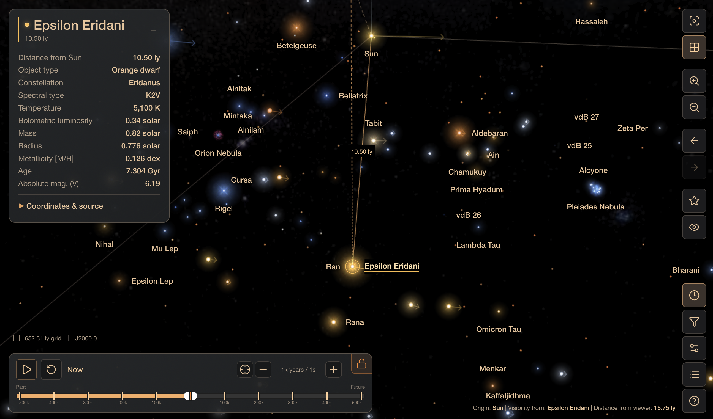

# Star View

A 3D map of nearby stars, brown dwarfs and compact remnants that runs in the browser. It starts Sun-centered and lets any object become the active origin. Built with TypeScript, Three.js and Vite. All data, fonts and icons are bundled, so it runs without a backend or network access.

This project is still in active development and there are a lot of features to come.

## Features

- Four bundled stellar catalogs: **Nearest neighbors** (21 objects plus the Sun, default), **Nearest 100**, **Nearest 1000**, and magnitude-limited **Bright stars** within 3000 light-years
- Optional, separately loaded compact-remnant overlay: 266 ATNF pulsars, Gaia NS1, Gaia BH1 and Gaia BH3 within 3000 light-years; all three type filters start off
- Orbit, zoom and pan with mouse or touch; selecting an object centers it
- Type-aware inspector with stellar properties or compact-object rotation, mass, orbital context, detection status and source notes
- Searchable origin-relative list of objects matching the active distance and object-type filters
- Map filters for brightness as seen from the selected star, distance from the active origin (to 3000 light-years), object type, and an optional deduplicated bright-star overlay
- Real or exaggerated temperature colors, magnitude-based glow, motion arrows, a seasonal Earth-orbit reference and an optional Galactic-aligned 360° Milky Way backdrop
- Distance and height guides relative to the active origin
- Rotation-only **Observer view** from any selected object, with the observing object hidden and other stars still selectable
- Light-year or parsec units, grid toggle and an optional power-saving mode
- Desktop and mobile layouts

## Getting Started

Requires Node.js 24 LTS, npm and a WebGL2-capable browser.

```sh
npm ci
npm run dev
```

Open the local URL printed by Vite.

| Command | Purpose |
| --- | --- |
| `npm run dev` | Start the development server |
| `npm run build` | Validate catalogs, type-check and build into `dist/` |
| `npm run preview` | Serve the production build |
| `npm run typecheck` | Type-check without building |
| `npm run test` | Run unit tests (Vitest) |
| `npm run test:e2e` | Build, then run desktop and mobile browser tests (Playwright) |
| `npm run catalog:validate` | Validate all bundled catalogs |

Before the first browser test run, install Chromium with `npx playwright install chromium`, or use installed Chrome via `PLAYWRIGHT_CHANNEL=chrome npm run test:e2e`.

`dist/` is a static site. When hosting it, configure the compression and caching headers described in [Development](docs/development.md#build-and-hosting).

## Controls

| Action | Mouse | Touch |
| --- | --- | --- |
| Orbit | Left-drag | One-finger drag |
| Zoom | Scroll wheel | Pinch |
| Pan | Right-drag | Two-finger drag |
| Select and center | Click an object | Tap an object |
| Clear selection | Click empty sky | Tap empty sky |

The toolbar has reset view, grid toggle, zoom controls, back/forward navigation through the 20 most recent star selections, **Set as origin**, and an eye-shaped **Observer view** toggle. Observer view fixes the camera at the object selected on entry and permits rotation only. Its compact **Observing from** card identifies the observing object, selects it when its name is clicked, rolls the view clockwise or counterclockwise, and resets it to level. Other stars remain selectable without measurement guides; exiting keeps the latest selection and applies Reset view. The Objects list supports search and keyboard selection; its star marker identifies the current origin.

## Data

The default catalog is [src/data/stars.csv](src/data/stars.csv); the others are in `src/data/catalogs/<id>/`. The compact-remnant source package is in `src/data/overlays/compact-remnants/`, with frozen authoring inputs under `catalog-work/compact-remnants/`. Builds validate them and generate browser-ready JSON automatically, without downloads or Python. The larger catalogs and overlay use audited, frozen source releases and make only the source-defined completeness claims documented in the sourcing guide.

Positions are a fixed J2000 snapshot in a Sun-centered, Galactic-aligned frame. Colors and glow are illustrative, not calibrated photometry.

## Documentation

- [User guide](docs/user-guide.md): browsing, filters and what the visuals mean
- [Data reference](docs/data-reference.md): coordinate frame, CSV format, sources and motion conversion (referenced by catalog source notes)
- [Catalog sourcing](docs/catalog-sourcing.md): how catalogs are built, reproduced and extended
- [Development](docs/development.md): build and hosting, rendering performance, tests and project structure

## License

See [LICENSE](LICENSE).
